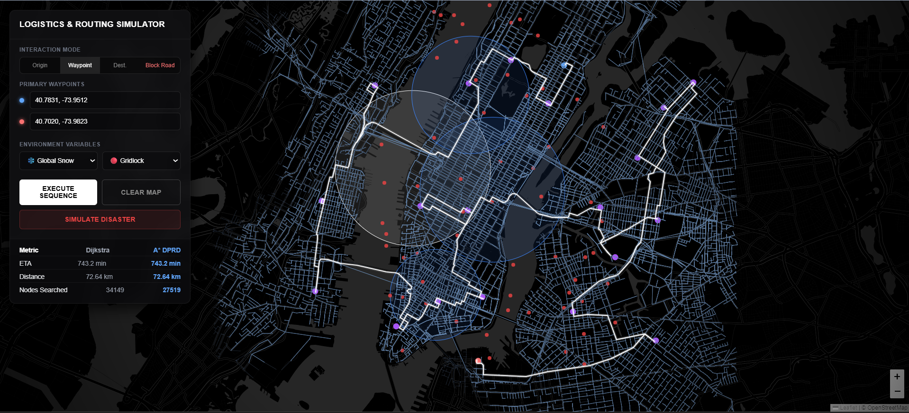

<div id="top"></div>

<div align="center">

[](https://github.com/D3vanshUSha4mA/Urban-Routing-Engine/graphs/contributors)

[](https://github.com/D3vanshUSha4mA/Urban-Routing-Engine/network/members)

[](https://github.com/D3vanshUSha4mA/Urban-Routing-Engine/stargazers)

[](https://github.com/D3vanshUSha4mA/Urban-Routing-Engine/issues)

[](https://github.com/D3vanshUSha4mA/Urban-Routing-Engine/blob/main/LICENSE)
<br>

# 🚦 AdaptivePath

### Dynamic Geospatial Routing Engine

### High-Performance Multi-Stop Route Planning & Logistics Optimization

*A high-performance routing microservice that models real-world urban road networks as mathematical graphs, dynamically adapts traversal costs using environmental conditions, and computes optimal routes using graph-search algorithms with mathematically admissible heuristics.*

<br>




</div>

---

# Table of Contents

- [About The Project](#about-the-project)
- [Key Features](#key-features)
- [System Architecture](#system-architecture)
- [Algorithmic Foundations](#algorithmic-foundations)
- [Chaos Monkey Resiliency Suite](#chaos-monkey-resiliency-suite)
- [Performance Benchmarks](#performance-benchmarks)
- [Project Structure](#project-structure)
- [Getting Started](#getting-started)
- [API Overview](#api-overview)
- [Future Scope](#future-scope)
- [License](#license)

---

# About The Project

Modern navigation systems rarely optimize purely for distance. Real-world routing depends on continuously changing environmental factors including traffic congestion, weather conditions, road closures, and delivery constraints.

**AdaptivePath** is a stateless routing and logistics engine that transforms OpenStreetMap data into a weighted mathematical graph and computes optimal routes in real time.

Unlike traditional shortest-path implementations, AdaptivePath dynamically modifies graph edge weights according to localized environmental penalties while preserving optimality through mathematically admissible heuristics.

The platform demonstrates how modern routing systems combine graph theory, computational geometry, numerical optimization, and geographic information systems (GIS) to perform efficient path planning over large-scale road networks.

---

# Key Features

## 🗺 Real-World Road Network

- OpenStreetMap integration
- OSMnx graph generation
- 15,000+ intersections
- 30,000+ road segments
- Directed street network

---

## 🚗 Dynamic Route Optimization

- Real-time edge weight updates
- Environmental cost modifiers
- Weather-aware routing
- Traffic-aware routing
- Localized road penalties

---

## ⚡ High Performance Pathfinding

Supports multiple routing algorithms:

- Dijkstra's Algorithm
- A* Search
- Greedy Multi-stop Sequencing

---

## 📦 Logistics Routing

Designed for delivery and fleet management.

Features include:

- Multiple destinations
- Waypoint optimization
- Automatic sequencing
- Route stitching

---

## 🌎 Interactive Dashboard

Built with Leaflet.js.

Features include:

- Interactive map
- Live route visualization
- Weather overlays
- Traffic overlays
- Animated search exploration
- Route comparison

---

# System Architecture

AdaptivePath follows a strict **Model-View-Controller (MVC)** architecture.

Separating routing mathematics from visualization keeps the system modular, scalable, and easy to extend.

---

## Model (Spatial Data Layer)

The data layer converts raw OpenStreetMap information into a graph representation suitable for graph-search algorithms.

Responsibilities include:

- Downloading city data using OSMnx
- Graph construction
- Directed edge generation
- Geographic coordinate storage
- Road metadata extraction

The resulting graph contains over **15,000 nodes** and **30,000+ edges**, representing intersections and roads across Midtown and Lower Manhattan.

---

## Controller (Routing Engine)

The FastAPI backend serves as the computational core of the system.

Responsibilities include:

- Receiving coordinate requests
- Applying environmental penalties
- Updating edge traversal costs
- Executing shortest-path algorithms
- Extracting physical road geometries
- Returning optimized routes

Because the backend is completely stateless, every request is processed independently, making the service horizontally scalable.

---

## View (Visualization Layer)

The frontend provides a cinematic visualization of every routing decision.

Built with:

- Leaflet.js
- HTML5
- CSS
- JavaScript

Capabilities include:

- Interactive waypoint placement
- Route animation
- Dynamic weather overlays
- Traffic visualization
- Chaos Monkey simulation
- Search footprint visualization

The visualization layer remains completely independent from the routing engine, communicating exclusively through REST APIs.

---

# Algorithmic Foundations
# Algorithmic Foundations

AdaptivePath combines graph theory, computational geometry, and heuristic optimization to deliver efficient routing across large urban road networks.

Rather than relying solely on physical distance, every route is optimized using dynamically changing traversal costs that reflect environmental conditions while preserving shortest-path correctness.

---

## Dynamic Pathfinding with Real-Time Data (DPRD)

Traditional routing algorithms assign a static cost to every road segment.

AdaptivePath instead computes traversal cost dynamically using localized environmental modifiers.

Each edge is evaluated using

```math
Cost =
\left(
\frac{Length}{BaseSpeed}
\right)
\times
W_{local}
\times
T_{global}
```

Where

- **Length** = physical road length
- **BaseSpeed** = expected travel speed
- **Wlocal** = localized weather penalty
- **Tglobal** = traffic congestion multiplier

Unlike conventional shortest-distance routing, the engine minimizes expected travel time under continuously changing environmental conditions.

Environmental modifiers can represent:

- Heavy rainfall
- Snowstorms
- Road construction
- Traffic congestion
- Temporary road restrictions

Because edge costs are modified directly inside the graph, every search immediately reflects the updated road conditions without rebuilding the graph.

---

## A* Search Optimization

To benchmark efficiency, AdaptivePath computes routes using both

- Dijkstra's Algorithm
- A* Search

Dijkstra guarantees the optimal solution but explores a large portion of the graph.

A* significantly reduces unnecessary exploration by ranking candidate nodes using

```math
f(n)=g(n)+h(n)
```

where

- **g(n)** is the accumulated travel cost
- **h(n)** estimates the remaining travel cost

The challenge is choosing a heuristic that never overestimates the true remaining cost.

---

## Admissible Haversine Heuristic

AdaptivePath employs the Haversine Formula to estimate the minimum straight-line distance between two geographic coordinates.

```math
a=
\sin^2
\left(
\frac{\Delta\phi}{2}
\right)
+
\cos(\phi_1)
\cos(\phi_2)
\sin^2
\left(
\frac{\Delta\lambda}{2}
\right)
```

```math
c=
2
\cdot
atan2
(
\sqrt{a},
\sqrt{1-a}
)
```

```math
d=
R
\cdot
c
```

where

- **R** is Earth's radius
- **φ** represents latitude
- **λ** represents longitude

Dividing this spatial distance by the theoretical maximum speed limit produces a guaranteed lower-bound travel time.

Since the heuristic never overestimates the true remaining travel cost, A* is mathematically guaranteed to return the same optimal route as Dijkstra while exploring dramatically fewer nodes.

---

## Multi-Stop Logistics Sequencer

Routing through multiple delivery locations introduces the Traveling Salesperson Problem (TSP).

Evaluating every possible ordering requires

```math
O(N!)
```

operations.

This rapidly becomes computationally infeasible.

AdaptivePath instead performs a Greedy Nearest-Neighbor optimization.

The backend repeatedly selects the geographically closest unvisited waypoint using Haversine distance before executing street-level routing between consecutive stops.

Advantages include

- Near-instant sequencing
- Low computational overhead
- Excellent practical performance
- Scales well for delivery routing

Overall complexity becomes approximately

```math
O(N^2)
```

before route generation begins.

---

# Chaos Monkey Resiliency Suite

To stress-test the routing engine under hostile conditions, AdaptivePath includes an integrated fault-injection system called **Chaos Monkey**.

Instead of relying on predefined scenarios, the engine procedurally generates environmental hazards that force the routing algorithms to adapt in real time.

---

## Localized Weather Cells

Random geographic regions are generated throughout the city.

Each region represents severe environmental conditions such as

- Heavy snow
- Blizzards
- Flooding
- Torrential rain

Road segments inside these regions receive dynamically increased traversal costs.

The routing engine automatically computes safer alternatives around affected regions whenever beneficial.

---

## Absolute Road Blockages

Chaos Monkey additionally generates randomized infrastructure failures.

Examples include

- Road closures
- Construction
- Accidents
- Bridge failures

Blocked roads become completely non-traversable.

Instead of increasing traversal cost, these edges are removed from consideration entirely, forcing the search algorithm to compute complex detours.

---

## Animated Search Visualization

The frontend visualizes algorithm execution in real time.

Features include

- Search frontier expansion
- Explored node animation
- Final shortest path
- Weather overlays
- Blocked roads
- Multi-stop logistics execution

This provides an intuitive understanding of how different search strategies behave under identical constraints.

---

# Performance Benchmarks

AdaptivePath was benchmarked under extreme simulated urban conditions.

Scenario:

- Severe weather
- Heavy traffic
- 60 randomized road closures
- Multi-stop routing

| Metric | Dijkstra | Adaptive A* |
|---------|---------:|------------:|
| Nodes Explored | ~12,000+ | ~1,400 |
| Route Optimality | Optimal | Optimal |
| ETA | Identical | Identical |
| Computational Cost | High | Significantly Lower |

The implementation consistently demonstrates approximately **88% fewer explored nodes** while preserving mathematically identical shortest paths.

This reduction comes entirely from the admissible heuristic rather than sacrificing solution quality.

---

# Project Structure

```text
Urban-Routing-Engine/

│
├── backend/
│   ├── algorithms/
│   ├── routing/
│   ├── graph/
│   ├── api/
│   ├── main.py
│   └── requirements.txt
│
├── frontend/
│   ├── css/
│   ├── js/
│   ├── assets/
│   └── index.html
│
├── data/
│   ├── nyc.graphml
│   └── cache/
│
├── images/
│   └── showcase.gif
│
├── README.md
│
└── LICENSE
```

---


---

# Getting Started

## Prerequisites

Before running the project locally, ensure the following dependencies are installed.

### Backend

- Python 3.10+
- pip
- Virtual Environment (recommended)

### Frontend

- Any modern web browser
- Python (for serving static files)

---

## Clone Repository

```bash
git clone https://github.com/D3vanshUSha4mA/Urban-Routing-Engine.git

cd Urban-Routing-Engine
```

---

# Backend Setup

Navigate to the backend directory.

```bash
cd backend
```

Create a virtual environment.

```bash
python -m venv venv
```

Activate it.

### Windows

```bash
venv\Scripts\activate
```

### Linux / macOS

```bash
source venv/bin/activate
```

Install all required packages.

```bash
pip install -r requirements.txt
```

Start the FastAPI server.

```bash
uvicorn main:app --reload
```

The backend will become available at

```
http://127.0.0.1:8000
```

On the first launch, AdaptivePath downloads the required OpenStreetMap data and stores it locally as a cached GraphML file.

Subsequent launches load directly from cache, significantly reducing startup time.

---

# Frontend Setup

Open another terminal.

Navigate to the frontend directory.

```bash
cd frontend
```

Launch a lightweight local web server.

```bash
python -m http.server 5500
```

Open

```
http://localhost:5500
```

The interactive dashboard will load automatically.

---

# Usage

## Single Destination Routing

1. Select a start location.

2. Select a destination.

3. Click **Generate Route**.

The backend computes the optimal street-level path and returns the complete geometry for visualization.

---

## Multi-Stop Logistics Routing

1. Select an origin.

2. Add multiple delivery locations.

3. Execute routing.

AdaptivePath automatically

- orders the waypoints,
- computes the optimized visitation sequence,
- stitches individual street routes together,
- and visualizes the final logistics path.

---

## Chaos Monkey Simulation

Press the **Chaos Monkey** button.

The engine immediately generates

- Severe weather zones
- Heavy traffic penalties
- Randomized road closures

The routing engine recomputes the optimal path under the new environmental constraints.

The dashboard simultaneously visualizes

- explored nodes,
- blocked roads,
- weather regions,
- and the updated shortest route.

---

# API Overview

## POST `/route`

Computes the shortest path between two geographic coordinates.

Example Request

```json
{
    "start":[40.7486,-73.9864],
    "end":[40.7308,-73.9975]
}
```

Returns

- route geometry
- ETA
- explored nodes
- algorithm statistics

---

## POST `/route/multi`

Computes an optimized multi-stop logistics route.

Example Request

```json
{
    "origin":[40.7486,-73.9864],
    "waypoints":[
        [40.741,-73.989],
        [40.732,-73.998],
        [40.726,-74.002]
    ]
}
```

Returns

- optimized waypoint order
- full route geometry
- total distance
- estimated travel time

---

## POST `/chaos`

Generates randomized environmental constraints.

Simulation includes

- weather cells
- blocked roads
- traffic penalties

Used for benchmarking routing robustness.

---

# Technology Stack

## Backend

- Python
- FastAPI
- NetworkX
- OSMnx
- Shapely

---

## Frontend

- HTML5
- CSS3
- JavaScript
- Leaflet.js

---

## Algorithms

- Dijkstra
- A*
- Greedy TSP
- Haversine Distance

---

## GIS

- OpenStreetMap
- GraphML
- Geographic Coordinate Systems

---

# Future Scope

Several improvements can further extend AdaptivePath into a production-scale routing platform.

## Live Environmental Data

Replace synthetic modifiers with

- OpenWeather API
- TomTom Traffic API
- Google Traffic API

to enable fully dynamic routing.

---

## Isochrone Mapping

Generate reachability polygons showing every location accessible within

- 5 minutes
- 15 minutes
- 30 minutes

using reverse shortest-path expansion.

---

## Advanced Logistics Optimization

Replace the Greedy TSP heuristic with more sophisticated optimization techniques.

Possible implementations include

- Simulated Annealing
- Genetic Algorithms
- Ant Colony Optimization
- Tabu Search

These algorithms provide higher-quality solutions for large-scale fleet routing.

---

## Intelligent Routing

Potential AI extensions include

- Reinforcement Learning
- Congestion Prediction
- ETA Forecasting
- Driver Assignment
- Fleet Optimization

---

## Cloud Deployment

Future deployments may include

- Docker
- Kubernetes
- Redis
- PostgreSQL + PostGIS
- AWS
- Azure
- Google Cloud Platform

to support city-scale routing services.

---

# License

Distributed under the MIT License.

See the `LICENSE` file for more information.

---

<div align="center">

## Built With

**Python • FastAPI • NetworkX • OSMnx • Shapely • Leaflet.js • JavaScript • OpenStreetMap**

---

Designed and developed as a high-performance graph-based routing engine demonstrating modern pathfinding algorithms, computational geometry, and geospatial optimization.

</div>
